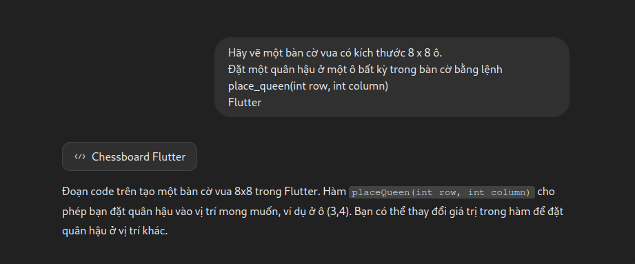
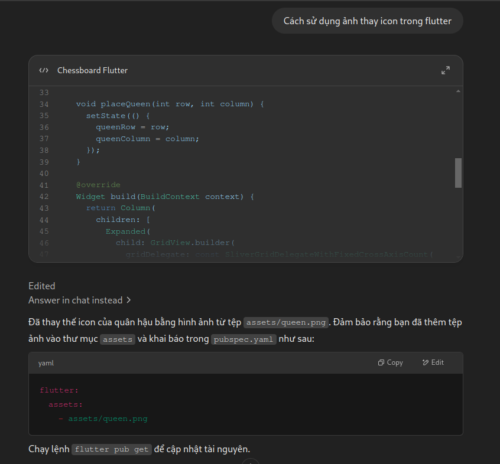

# Bài 1: Vẽ bàn cờ vua và đặt quân hậu

## Mô tả

Dự án này vẽ một bàn cờ vua có kích thước 8x8 ô, với một quân hậu được đặt ở vị trí bất kỳ trong bàn cờ.

## Cách giải quyết

1. **Tạo bàn cờ**: Bàn cờ được tạo ra bằng `GridView`, nơi mỗi ô trong bàn cờ có màu trắng hoặc xám thay đổi theo chỉ số của hàng và cột.
2. **Đặt quân hậu**: Quân hậu được biểu thị bằng một hình ảnh (được lưu trữ trong thư mục `assets/images/queen.png`). Khi người dùng nhấn vào một ô, quân hậu sẽ được đặt tại vị trí đó.
3. **Đặt quân hậu ngẫu nhiên**: Một nút `ElevatedButton` cho phép người dùng đặt quân hậu vào một ô ngẫu nhiên trên bàn cờ. Để làm điều này, chúng tôi sử dụng hàm `Random()` để tạo ra các số ngẫu nhiên cho hàng và cột.

## Prompt đã hỏi AI

**Câu hỏi**: `Hãy vẽ một bàn cờ vua có kích thước 8 x 8 ô.  
Đặt một quân hậu ở một ô bất kỳ trong bàn cờ bằng lệnh place_queen(int row, int column) Flutter`

**AI trả lời**:

**Câu hỏi**: `Cách sử dụng ảnh thay icon trong flutter`

**AI trả lời**:

## Hình ảnh kết quả

    

        <h3>Android</h3>
        <video width="320" height="240" controls>
        <source src="./assets/board_queen_m.mp4" type="video/mp4">
        Your browser does not support the video tag.
        </video>
    

    

        <h3>Linux</h3>
        <video width="320" height="240" controls>
        <source src="./assets/board_queen_l.mp4" type="video/mp4">
        Your browser does not support the video tag.
        </video>
    

