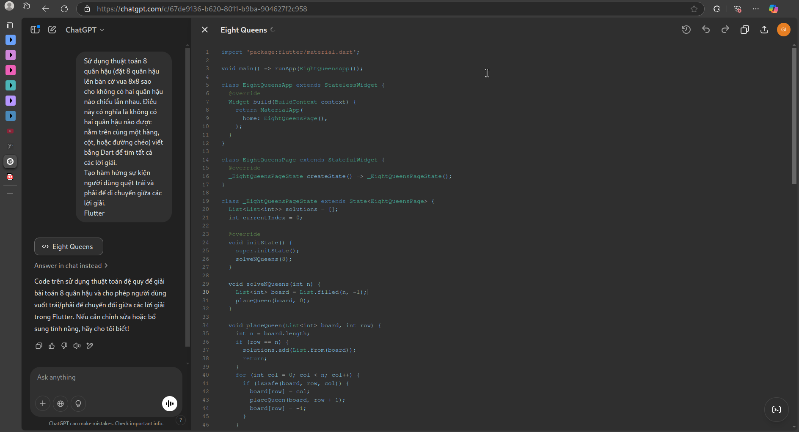

# Bài 2: Giải bài toán 8 huân hậu

## Mô tả

Dự án này giải bài toán 8 quân hậu, trong đó bạn cần đặt 8 quân hậu lên bàn cờ 8x8 sao cho không quân hậu nào có thể ăn quân hậu khác (quân hậu không được đặt cùng hàng, cột hoặc đường chéo). Dự án cung cấp một giao diện người dùng để hiển thị các giải pháp và cho phép người dùng điều hướng giữa các giải pháp bằng cách vuốt hoặc nhấn nút.

## Cách giải quyết

**Thuật toán giải quyết bài toán 8 quân hậu**:
   - Sử dụng thuật toán quay lui (backtracking) để thử đặt quân hậu vào các ô trên bàn cờ.
   - Hàm `isSafe` kiểm tra xem quân hậu có thể đặt vào một ô cụ thể mà không bị quân hậu khác ăn.
   - Hàm `solve` sử dụng thuật toán quay lui để tìm ra tất cả các giải pháp hợp lệ.

## Prompt đã hỏi AI

**Câu hỏi**: `Sử dụng thuật toán 8 quân hậu (đặt 8 quân hậu lên bàn cờ vua 8x8 sao cho không có hai quân hậu nào chiếu lẫn nhau. Điều này có nghĩa là không có hai quân hậu nào được nằm trên cùng một hàng, cột, hoặc đường chéo) viết bằng Dart để tìm tất cả các lời giải. Tạo hàm hứng sự kiện người dùng quệt trái và phải để di chuyển giữa các lời giải.
Flutter`

**AI trả lời**:

## Hình ảnh kết quả

    

        <h3>Android</h3>
        <video width="320" height="240" controls>
        <source src="./assets/eight_queens_m.mp4" type="video/mp4">
        Your browser does not support the video tag.
        </video>
    

    

        <h3>Linux</h3>
        <video width="320" height="240" controls>
        <source src="./assets/eight_queens_l.mp4" type="video/mp4">
        Your browser does not support the video tag.
        </video>
    

