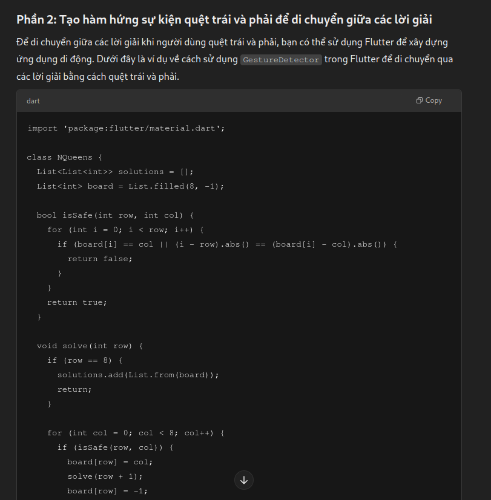

# Bài 3: Vẽ bàn cờ vua và đặt quân hậu

## Mô tả

Ứng dụng này giải quyết bài toán "8 quân hậu" bằng cách tìm tất cả các cách đặt 8 quân hậu trên bàn cờ 8x8 sao cho không có hai quân hậu nào chiếu lẫn nhau. Các thuật toán tìm kiếm lời giải được viết bằng ngôn ngữ C để tối ưu hóa hiệu suất, và chúng được gọi từ Dart qua FFI (Foreign Function Interface).

Ứng dụng sẽ hiển thị từng lời giải trên bàn cờ 8x8, đồng thời người dùng có thể di chuyển giữa các lời giải bằng cách quẹt trái hoặc phải trên màn hình.

## Cách giải quyết

Thuật toán 8 quân hậu sẽ được viết bằng C, và sử dụng FFI để gọi từ Dart.

1. **Dựa vào `Bài 2`**

2. **Gọi Thuật Toán C từ Dart thông qua FFI**:

   - Để gọi thư viện C từ Dart, sử dụng gói `ffi` trong Dart.

3. https://dart.dev/interop/c-interop

4. https://medium.com/@salahinetelecom/integrating-c-code-with-flutter-using-dart-ffi-a-step-by-step-guide-6286050e7dfc

5. https://codelabs.developers.google.com/codelabs/flutter-ffigen#0

## Prompt đã hỏi AI

**Câu hỏi**: `Sử dụng thuật toán 8 quân hậu (đặt 8 quân hậu lên bàn cờ vua 8x8 sao cho không có hai quân hậu nào chiếu lẫn nhau. Điều này có nghĩa là không có hai quân hậu nào được nằm trên cùng một hàng, cột, hoặc đường chéo) viết bằng Dart để tìm tất cả các lời giải. 
Tạo hàm hứng sự kiện người dùng quệt trái và phải để di chuyển giữa các lời giải.
Thay vì sử dụng thuật toán viết bằng Dart hay chuyển sang viết hàm tìm các vị trí của 8 quân hậu bằng C, rồi dùng kỹ thuật FFI để gọi từ Dart xuống`

**AI trả lời**:

**Câu hỏi**: `Viết thuật toán 8 quân hậu bằng C`

**AI trả lời**:

**Câu hỏi**: `Tạo 1 project flutter với ffi`

**AI trả lời**:

## Hình ảnh kết quả

    

        <h3>Android</h3>
        <video width="320" height="240" controls>
        <source src="./assets/eight_queens_ffi_m.mp4" type="video/mp4">
        Your browser does not support the video tag.
        </video>
    

    

        <h3>Linux</h3>
        <video width="320" height="240" controls>
        <source src="./assets/eight_queens_ffi_l.mp4" type="video/mp4">
        Your browser does not support the video tag.
        </video>
    

