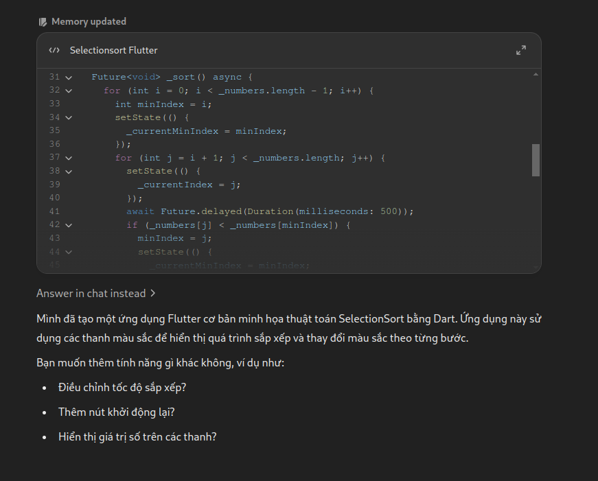

# Bài 4: Minh họa thuật toán Selection Sort sử dụng FFI

## Mô tả

Ứng dụng này minh họa thuật toán **Selection Sort** được viết bằng C và gọi từ Dart qua **FFI (Foreign Function Interface)**. Ứng dụng sẽ thực hiện sắp xếp một mảng số nguyên và hiển thị quá trình sắp xếp đó thông qua **animation** trực quan.

## Cách giải quyết

1. **Dựa vào `Bài 3`**

2. Viết thuật toán Selection Sort bằng C. Thuật toán này tìm phần tử nhỏ nhất trong danh sách chưa sắp xếp và hoán đổi nó với phần tử đầu tiên chưa sắp xếp.

3. Sử dụng FFI để gọi các hàm trong mã C.

4. Tạo giao diện với các phần tử mảng được hiển thị dưới dạng các thanh. Các thanh này được tô màu theo các trạng thái của thuật toán (đang so sánh, hoán đổi, đã sắp xếp).

## Prompt đã hỏi AI

**Câu hỏi**: `Viết một ứng dụng Flutter minh họa animation trực quan thuật toán SelectionSort chạy bằng C.`

**AI trả lời**:

**Câu hỏi**: `Thêm animation vào để khi sắp xếp có thể dễ dàng hình dùng hơn.`

**Câu hỏi**: `Bạn viết lại thư viện C để nó trả về phần tử và trạng thái hoặc màu tương ứng được không`

## Hình ảnh kết quả

    

        <h3>Android</h3>
        <video width="320" height="240" controls>
        <source src="./assets/selection_sort_m.mp4" type="video/mp4">
        Your browser does not support the video tag.
        </video>
    

    

        <h3>Linux</h3>
        <video width="320" height="240" controls>
        <source src="./assets/selection_sort_l.mp4" type="video/mp4">
        Your browser does not support the video tag.
        </video>
    

