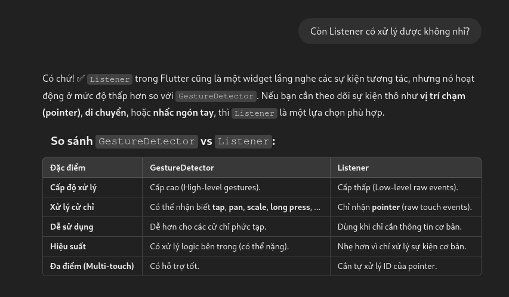

# Bài 5: Lập trình xử lý đa chạm để vẽ một tam giác có 3 đỉnh.  Người dùng có thể chạm vào từng đỉnh để di chuyển vẽ lại tam giác

## Mô tả

Ứng dụng này cho phép người dùng vẽ một tam giác trên màn hình thông qua thao tác đa chạm. Người dùng có thể chạm vào từng đỉnh của tam giác để di chuyển các điểm và vẽ lại tam giác theo vị trí mới của các đỉnh.

## Cách giải quyết

1. **Nhận diện chạm (Gesture Detection)**: 
    - Sử dụng `GestureDetector` để nhận diện các cử chỉ chạm và kéo (drag).
    - Chúng ta sử dụng các sự kiện `onPanStart`, `onPanUpdate`, và `onPanEnd` để di chuyển các đỉnh của tam giác.

2. **Thêm và di chuyển các điểm**:
   - Người dùng có thể chạm vào ba điểm để tạo thành tam giác. Mỗi lần chạm vào màn hình sẽ thêm một đỉnh vào tam giác.
   - Sau khi ba điểm đã được tạo thành, người dùng có thể kéo (drag) các đỉnh để di chuyển các điểm của tam giác.

3. **Kiểm tra khoảng cách**:
   - Hàm `isPointCloseToOthers` kiểm tra xem các điểm mới có quá gần các điểm đã tồn tại không để tránh chồng lắp.
   
4. **Vẽ tam giác**:
   - Tam giác được vẽ trên màn hình với ba đỉnh đã được chọn.
   - Khi người dùng kéo một đỉnh, tam giác được vẽ lại với các đỉnh mới.

5. **Giao diện người dùng**:
   - Người dùng có thể xóa tam giác và vẽ lại bằng cách nhấn vào nút làm mới (refresh).
   - Mỗi đỉnh của tam giác sẽ được hiển thị dưới dạng một vòng tròn đỏ, và khi đỉnh được chọn, màu sắc sẽ thay đổi để hiển thị rằng đỉnh đang được di chuyển.

6. **[Implementing complex gestures and touch interactions in Flutter](https://codemax.app/snippet/implementing-complex-gestures-and-touch-interactions-in-flutter/)**

## Prompt đã hỏi AI

**Câu hỏi**: `Lập trình xử lý đa chạm để vẽ một tam giác có 3 đỉnh. Người dùng có thể chạm vào từng đỉnh để di chuyển vẽ lại tam giác
Flutter`

**AI trả lời**:

**Câu hỏi**: `Cách sử dụng GestureDetector chi tiết`

**AI trả lời**:

**Câu hỏi**: `Còn Listener có xử lý được không nhỉ?`

**AI trả lời**:

## Hình ảnh kết quả

    

        <h3>Android</h3>
        <video width="320" height="240" controls>
        <source src="./assets/touch_triangle_m.mp4" type="video/mp4">
        Your browser does not support the video tag.
        </video>
    

    

        <h3>Linux</h3>
        <video width="320" height="240" controls>
        <source src="./assets/touch_triangle_l.mp4" type="video/mp4">
        Your browser does not support the video tag.
        </video>
    

